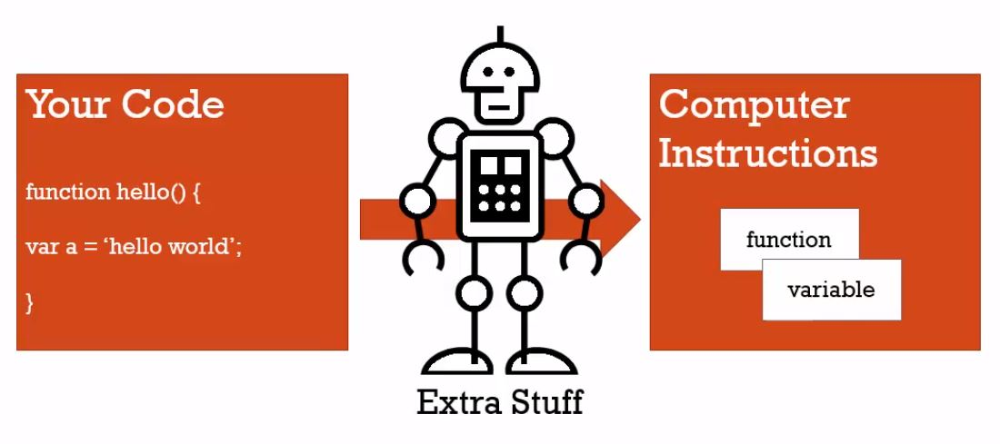

相信你看完這篇就不會想學 JavaScript 了。

<!-- more -->

## 語法解析器（Syntax Parsers）
---


> A program that **reads your code** and **determines what it does** and **if its grammar is valid**.

語法解析器，或稱「編譯器／直譯器」（Compiler／Interpreter），會將我們所寫的程式碼轉換成電腦（硬體）能夠接收的指令。

在 JavaScript 中，語法解析器會一字一句的解析我們所寫的程式碼，並決定程式碼是否有效，或是語法上有沒有出錯。

例如 `function say() {...}` 這段程式碼，語法解析器會逐字解析為：

**f-u-n-c-t-i-o-n-空格-s-a-y-(-是否有代入參數-)-{-函式區塊內容-}** 


語法解析器會對照該段程式碼與該程式語言所規範的語法結構： `function 名稱(參數) {函式內容}` ，如果都沒有語法上的錯誤，即決定這段程式碼為一個有效的**函式（function）**。

如果語法有誤（拼錯、漏字、順序不對等等），即會出現常見的 `SyntaxError` 。

**JavaScript 不是一種程式語言嗎？為什麼還需要 Syntax Parser 去解析成電腦才懂的語言？**
因為不是所有程式語言都是電腦懂的指令碼，就 JavaScript 而言，它是屬於高階程式語言（High-level language）的一種（其他如 C 、 Java 等等），需要經由編譯器（Compiler）將其原始碼轉換成電腦可以解讀、執行的低階機器語言，即目標語言（機器碼 Machine Code）。


小結：
1. Syntax Parsers 是一個中介轉譯器，協助我們（寫的程式碼）與電腦（韌體）溝通，
2. 電腦（韌體）接收到的指令，其實不完全是我們寫的程式碼，而是經過 Syntax Parsers 轉譯過的指令。



## 詞彙環境（Lexical Environments）
---

> Where something sits physically in **the code you write**.

簡單來說，詞彙環境指的是**你的（某一段） Code 寫在哪裡？附近有哪些 Code ？**。

**程式碼的位置，決定了語法解析器如何解析你所寫的程式碼**，這在 JavaScript 中尤其重要，很多**JavaScript 奇怪的部分**就是因為 lexical 的緣故，這在我們後面提到變數環境、函式作用域與範圍鏈（Scope Chain）時就能深刻體會到箇中奧妙。

有時候我們寫的程式碼執行結果與期待不符，往往就是因為寫錯 **Code 的位置（lexical）**。更直白地說，我們**不夠熟悉程式語言（JavaScript）解析語法的邏輯和規範**。

譬如下面這段程式碼：

```javascript:title=example.js
var a = 100 ; var b = 100 ;
console.log(a++,++b) // 結果會出現什麼？
console.log(a,b) // 那這個結果會出現什麼？

// 我猜你現在心裡 OS：What the ... ?????
```

小結：
* 你的（某一段） Code 寫在哪裡很重要！
* 你的（某一段） Code 寫在哪裡很重要！！
* 你的（某一段） Code 寫在哪裡很重要！！！
* 可以說，學習一門程式語言，最核心技術面關鍵便是**掌握該語言的語法結構**。

## 執行脈絡（Execution Contexts）
---

> **A wrapper** to **help** manage **the code** that is **running**.

講到脈絡（context），這個詞，~~就得提到歷史社會學（Historical sociology）~~，它最常被用來代指「（一個事件的）來龍去脈」：什麼先發生？什麼接著發生？發生的時候，客觀環境是怎麼樣？諸如此類，譬如「社會脈絡」、「歷史脈絡」等詞。

用這樣的語義去思考，程式語言中的執行脈絡（又稱「執行環境」）指的是，**正在執行的 Code 所處的脈絡（上下文）為何？前面有哪些 Code ？後面接了哪些 Code ？被什麼 Code 所包覆（wrapped）？**。

表面上，執行脈絡包含你所寫的、正在執行的程式碼，但，其實，**它不只包含你寫的 Code** ，還包含處理其他事情（do other things），因為你的 Code 事實上會經過編譯器轉換，而編譯器轉換的方式不盡然只執行你寫的 Code 。（傲嬌的編譯器？）

簡單理解 JavaScript 的執行脈絡，可以舉這個例子：在函式（function）中宣告變數（Variable）。
```javascript:title=example.js
function testA(){
  var a = 100 ;
  console.log(a) ; // 這裡的 a 是多少？
  testB() ;
} 

function testB(){
  var a = 200 ;
  console.log(a) ; // 這裡的 a 又是多少？
}

var a ;
testA() ;
console.log(a) ; // 那這裡的 a 呢？

// 上述程式碼執行後的結果， a 值印出順序為何？
```

## 結論
---

* 語法解析器：我們所寫的 JavaScript 必須經由語法解析器轉換成電腦（韌體）理解的語言，所以，語義很重要！
* 詞彙環境：Code 寫的位置（語法結構）很重要！
* 執行脈絡：目前執行的 Code 所處的環境／上下文是什麼？

## 參考資料
---
1. JavaScript 全攻略：克服 JS 奇怪的部分 2-6


