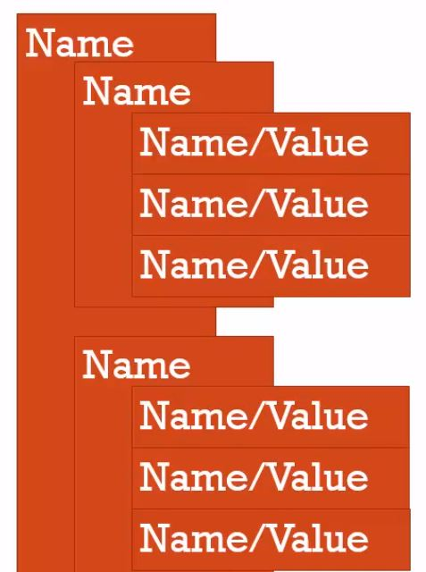

Name/Value Pair？ Key/Value Pair？沒差啦！反正就得成雙成對。

<!-- more -->

## 名稱／數值配對（Name/Value Pair）
---

> **A Name which maps to a unique value**. The name may be defined more than one, but **only can have one value in any given context**.

**在執行環境中，只能存在一個名稱（Name），且該名稱只會對應到一個定義的數值（Value）**，即所謂的 Name/Value Pair，也有人稱為「鍵值配對」Key/Value Pair，類似 `Python` 中的「字典」（Dictionary）結構。

基本的 Name/Value Pair 就像這樣：

```javascript
personName = 'Marisa' ;
```

> That value may be more name/value pair.

但實際上， value 可以是更多 Name/Value Pairs 的集合：

 ```javascript
peopleName = {
  DavidFamily: 'David',
  LisaFamily: {
    father: 'Ryan'.
    mother: 'Ann',
    dog: 'Murffy'
    }
  } ;
```

## 物件（Object）
---

> A collection of name/value pairs.

在 JavaScript 中，物件最簡單的定義就是，**物件（Object）是一群 ame/value pairs 的集合**。

我們用左右大括號 `{}` 來表示物件，一個基本的物件長這樣：

 ```javascript
Taipei = {
  Districts: 12,
  MetroLines: 5,
  touristSpot: 'Taipei 101'
}
```

因為 Name/Value Pair 中的 Value 也可以是另一組  Name/Value Pairs ，所以物件也可以是：

 ```javascript
Taipei = {
  Districts: 12,
  MetroLines: 5,
  touristSpot: {
    mustGo : 'Taipei 101',　
    mustEat : ['Ding-Tai-Fung', 'bubble tea'] // Value 也可以是陣列（Array），因為陣列也屬於物件的一種。
  }
}
```
在上面這個範例中，最外層的 `Taipei` 是一個物件，內層的 `touristSpot` 也是一個物件。因為**物件就是鍵值配對（Name/Value Pair）的集合**。



更精確地說，在 JavaScript 中，資料型別分為兩類：
1. 基本型別／原始型別（Primitive）
  * 字串（String）
  * 數字（Number）
  * 布林值（Boolean）
  * 空值（Null）
  * 未定義（Undefined）
  * Symbol（ES6 新增的型別）
2. 物件型別（Object）
  * 物件（Object）
    * 陣列物件（Array）
    * 函式物件（Function）

關於資料型別的詳細解釋，我們之後會提到。

## 結論
---

* 名稱／數值配對（鍵值配對）指的是，在一執行環境中，一個名稱只能對應到一個值，且值可能是另一個物件（鍵值配對的集合）。
* 物件指的是**鍵值配對的集合**。
* **在 JavaScript 中，任何一筆資料，如果不是基本型別（值），就是物件型別。**

## 參考資料
---
1. JavaScript 全攻略：克服 JS 奇怪的部分 2-7
2. [MDN：JavaScript data types and data structures](https://developer.mozilla.org/en-US/docs/Web/JavaScript/Data_structures)

