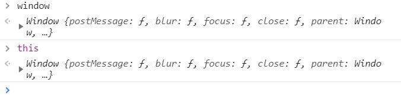
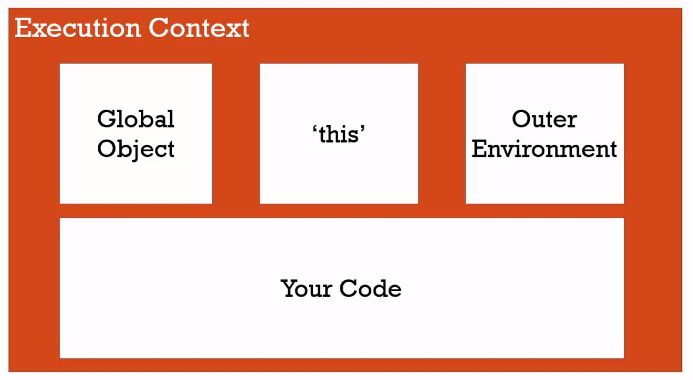

還記得之前提到的**執行脈絡／環境（Execution Context）**嗎？ 

<!-- more -->

## 全域環境
---

JavaScript 的全域（Global）環境，指的就是 **（最）外部執行環境（Outer Environment）**，也是語法解析器解析 JavaScript 程式碼的地方，換句話說，你所寫的程式碼如果不在函式裡，那必然在**函式外（Not in a function），即全域環境**。

而全域的意思是，**在全域環境所儲存的變數或函式，在其下任一（子）執行環境，都能夠直接取用那些全域變數或函式**。譬如下面這段程式碼，在 function `show` 中，能夠抓到全域環境中宣告的變數 `a` 。

```javascript
var a = 'Hello JavaScript!!' ;

function show(){
  console.log(a) ; // 'Hello JavaScript!!'
}

show() ;
```

在全域環境下，JavaScript 引擎會自動幫我們產生兩樣東西：
1. 全域物件（Global Object）
2. 變數 `this`

 

如上圖，我們在 Google Chrome Dev Tool 中分別輸入 `window` 和 `this` ，會發現在全域環境下，**`this` 同樣指向 `window` 這個全域物件**。

全域物件在不同的程式語言中有不同名稱，在瀏覽器（JavaScript 檔案）裡即是 `window` ，它已經儲存一些基本的函式（Function）和方法（Method）供我們使用，當然，我們也可以儲存變數在 `window` 這個**全域物件**裡面，這些被存在全域環境中的變數，就是俗稱的**全域變數（Global Variable）**。

譬如下面這段程式碼：

```javascript
var a = 'Hello JavaScript!!' ;
var b = function foo(){return 100} ;

console.log(a, b) ; // 'Hello JavaScript!!' ƒ foo(){return 100};
console.log(window.a, window.b) ; // 'Hello JavaScript!!' ƒ foo(){return 100};
```

既然全域物件命名為 `window` （視窗），就表示：每一個網頁（視窗）都是一個（全域）執行環境，互相獨立，互不干擾。

## 結論
---

最後，可以用課程內這張圖來總結：

 

* 全域環境是 JS 最外層的執行環境（Outer Environment），它等於全域物件 `window` 。
* 全域環境，或說全域物件 `window` ，即：不在函式裡（Not in a function）。
* 在全域環境中，變數 `this` 等於全域物件 `window` 。
* 每一個網頁（視窗）都是一個 `window` ，互相獨立。

## 參考資料
---
1. JavaScript 全攻略：克服 JS 奇怪的部分 2-9
