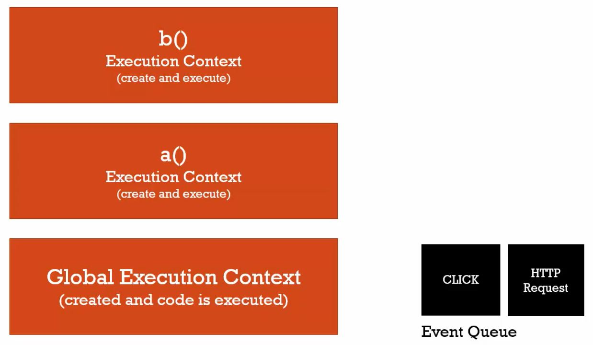

JavaScript **本身**是一門**單執行緒**且**同步執行**的高階程式語言。

<!-- more -->

### 單執行緒（Single Threaded）

**One command at a time.**


單執行緒的意思是， JavaScript 一次**只能做一件事情**（一行指令）。

<hr>

### 同步執行（Synchronous Execution）

**One at a time and in order.**


同步執行的意思是， JavaScript 一次只能做一件事情，這件做完，才能做下一件，**按照順序一件接著一件**（逐行執行命令）。

小飛：「可是我聽過 JavaScript 有一個特色叫做 **非同步（Asynchronous）**耶？」

好，既然你誠心誠意發問了，我就...

<hr>

### 非同步（Asynchronous）


**More than one at a time.**


非同步的意思是，「同時間可以做不只一件事」。

注意！我說的**不是** JavaScript。再次強調，**JS 引擎是同步執行的**，一次只能做一件事且按照指令順序。

那為什麼非同步會是 JavaScript 的特色呢？那是因為**JavaScript 引擎可以和瀏覽器內其他引擎溝通，互相合作**。

事實上，瀏覽器裡不只包含 JS 引擎，也包含負責畫面呈現的**渲染引擎（Rendering Engine）**、獲取伺服器資料的 **請求方法（HTTP Request Methods）** 等等。

而 JavaScript 引擎內有個東西叫作**事件佇列（Event Queue）**，**JS 會把需要和其他引擎合作的事件，暫時放在事件佇列裡等待處理**。

這裡可以用兩個例子來說明。

### 例1. JS 與 Rendering Engine 合作的非同步事件

當我們在 JavaScript 中監聽一則 `click` 事件，因為它需要使用者點擊滑鼠來觸發事件，所以 JS 會把這個事件暫時放進事件佇列中，**等到 JS 逐行跑完（全域執行環境的）指令，也就是執行堆疊（Execution Stack）為空以後**，再來執行這則 `click` 事件（事件觸發後由 Rendering Engine 渲染畫面）。譬如下面這段程式碼：

```javascript
// 全域執行開始
console.log('start execution (time countdown starts)') 
function waitFiveSeconds(){
  var endTime = 5000 + new Date().getTime() ;
  while(new Date() < endTime){}　// 5 秒內不會做任何事，此時點擊網頁，click 事件不會立刻被執行，而是被放進事件佇列等待。
  console.log('finished function (5 seconds passed)') ;　
  // 函式 waitFiveSeconds 結束（結束 waitFiveSeconds 執行堆疊）
}

function clickHandler(){　// 宣告　click 事件（函式）
  console.log('click event !') ;
}

document.addEventListener('click',clickHandler) ; // 註冊 click 事件

waitFiveSeconds() ; // 執行函式 waitFiveSeconds （建立 waitFiveSeconds 執行堆疊）
console.log('finished execution') ;　
// 全域執行結束，開始執行事件佇列的事件（執行 clickHandler -> 印出 'click event !' -> 結束 clickHandler）。
// 持續檢查事件佇列，若有新的事件觸發（被丟進佇列），便立即執行。
```

執行結果如下：

```
start execution (time countdown starts)
finished function (5 seconds passed)
finished execution
click event !　// 你點擊網頁（觸發 click）多少次，這裡就會有多少個 click event !
```

### 例2. JS 與 HTTP Request 合作的非同步事件

當我們在 JavaScript 中利用 HTTP Request 向伺服器發出一則資料請求，由於等待回覆（Response）必然耗時，所以 JS 會把這個請求（Request）暫時放進事件佇列中**等待回覆**（請求已經發出，並由 HTTP Request Methods 執行），**等到 JS 逐行跑完（全域執行環境的）指令，也就是執行堆疊（Execution Stack）為空以後**，再來處理伺服器 Response 的資料。


<center>JS 會優先處理腳本中的執行堆疊，最後才執行事件佇列。</center>

我們可以把事件佇列想像成 JS 引擎的對外窗口，每當 JS 遇到需要和其他引擎合作的事件，會將這些事件依序放進事件佇列，先專心跑完全域執行環境的程式碼後，再回頭逐一執行事件佇列裡的任務。

你也可以把事件佇列想像成一個大函式，把需要**非同步執行**的事件都先放進去，爾後再拿出來執行。這樣的方式，就是所謂的**非同步回呼（Asynchronous Callback）**。而那些**JS 需要和其他引擎合作的事件（函式）**，或說，這些**被 JS 放進事件佇列裡的事件（函式）**，正是一種**回呼函式（Callback Function）**。

用生活化的方式解釋回呼，大概就像這個情境：白白（JS）一次只能做一件事，他現在正在和客戶A講電話，突然客戶B來電，白白就寫了張MEMO（事件佇列）：「客戶A談完要打給客戶B」。下一秒客戶C又來電，於是白白又寫下：「B客戶談完後要打給C」。~~然後就得加班了？~~

關於回呼的概念我們之後有機會再細談，回到事件佇列上。

當事件佇列裡排定的事件都處理完後，JS 也不會閒著，它會**持續檢查（Continuous Check）**事件佇列有沒有新的事件進來，如果有的話，就會立即處理，如 ※例1. 的程式碼。

發現了嗎？ JavaScript 這樣的執行流程，依然是**同步**的：一次只做一件事，這個做完再做下一個，按順序執行。

總而言之，JavaScript 本身雖然是**同步**的，但因為它能夠利用事件佇列與瀏覽器中的其他引擎互相溝通、分工合作，達到**非同步**的效果，非同步也就成為了 JS 的特色。

最後，需要特別注意的是，**JS 非同步的部分，發生在 JS 引擎之外**，也就是其他協作引擎所執行的。

<hr>

### 結論
* JavaScript 本身是一門單執行緒且同步執行的高階程式語言，意思是，它一次只能做一件事情，而且必須按順序執行，執行完一件才能繼續做下一件。
* JavaScript 能夠利用事件佇列與瀏覽器中的其他引擎互相溝通、分工合作，利用同步達到非同步的效果，使得非同步成為 JS 的特色。


### 參考資料
1. JavaScript 全攻略：克服 JS 奇怪的部分 2-13、2-18
2. [先來看看瀏覽器內核長怎樣吧！](https://ithelp.ithome.com.tw/articles/10191427)
3. [MDN：Callback function](https://developer.mozilla.org/en-US/docs/Glossary/Callback_function)
