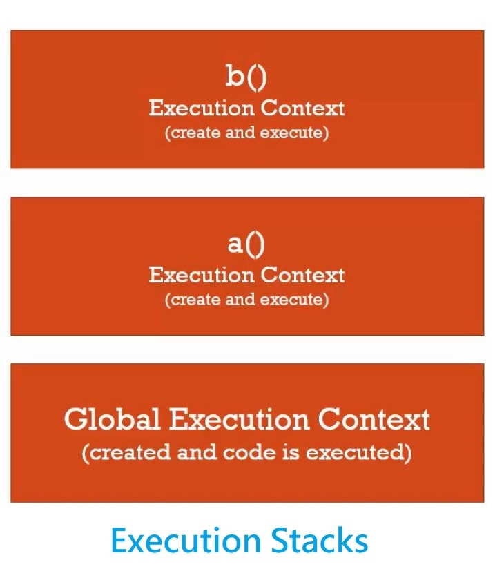

每當我們呼叫一個函式，JS 會立即建立屬於該函式的執行環境，然後堆起來（？）

<!-- more -->

### 呼叫（Invocation）


Running a function



在 JS 中，我們以 `函式名稱` 加上一對 `()` ，來呼叫（Invoke）函式，也就是**執行**該函式的意思。

每當我們呼叫一個函式時，JS 會立即**建立屬於該函式的執行環境（Execution Context），並執行該函式**。

所以，我們可以得出一個小口訣：**有事件（函式），就有執行脈絡（執行環境）。**

以下面這段程式碼為例，駐記說明 JavaScript 引擎做了哪些事情。

```javascript
// 建立 Global Execution Context
// Creation & Hoisting : 宣告 function b
// Creation & Hoisting : 宣告 function a
function b(){
  console.log('Run function b.') ;　// 印出 Run function b.
  // function b 結束，消滅 function a 的執行環境，並回到 function a。
}

function a(){
  b() ; // 建立 function b 的執行環境，執行 function b。
  // function a 結束，消滅 function a 的執行環境，並回到 Global Execution Context。
}

a() ; // 建立 function a 的執行環境，執行 function a 。

// 消滅 Global Execution Context
```
<hr>

###  執行堆疊（Execution Stacks）

從上面的程式碼範例，我們可以歸納出 JS 建立執行環境的流程（順序）大致如下：

> **Global** Execution Context → **function a** Execution Context → **function b** Execution Context

建立執行環境的順序，我們可以用下面這張圖來想像：



如同圖，所謂執行堆疊，意思是 JS 所建立的執行環境，會一層一層往上疊加，堆在最上方的執行環境，即**正在執行的事件（函式）**。

反過來看，從上面的程式碼範例，我們同樣可以歸納出 JS 消滅執行環境的流程（順序）：


**function b** Execution Context → **function a** Execution Context → **Global** Execution Context  



當一個個事件（函式）完成後，JS 消滅執行環境的順序，也會一層一層往下移除，直到執行堆疊為空。

啊！順帶一提，還記得我上回說過：當執行堆疊為空， JS 會做什麼呢？


對，檢視事件佇列是否有待回呼事件，若有就依序執行。


回到執行堆疊本身，我認為它是用來幫助我們理解 **JS 引擎執行函式順序**的概念，也就是說，它並不是真的存在於 JS 裡的一個系統，也不是一個範圍，只是我們想像出來的概念而已。

此外，我也覺得，用「堆疊」這個詞來描繪並不精確，如果用「深度」來形容似乎貼切多了，因為我們在全域中呼叫函式，在函式中呼叫另一個函式，相互呼叫，呼叫得愈多，執行深度也愈深。

這段只是我的小MurMur，往後還是會以執行堆疊來描述 JS 執行函式順序的概念。

<hr>

### 結論
* 在 JavaScript 中，呼叫函式等於執行函式。
* 每呼叫一個函式，JS 會即刻建立屬於該函式的執行環境，並執行該函式。
* 執行堆疊的意思是， JS 所建立的執行環境會一層一層往上堆疊，堆在最上方的執行環境，就是正在執行的函式。
* 執行堆疊的概念用來幫助我們瞭解 JS 引擎執行函式的順序。

### 參考資料
1. JavaScript 全攻略：克服 JS 奇怪的部分 2-14


