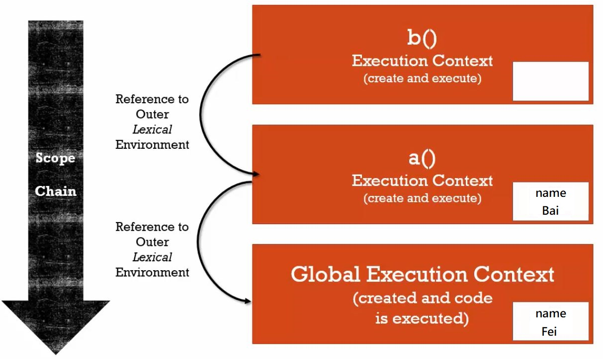

判斷變數屬於**全域變數（Global Variable）**還是**區域變數（Local Variable）**，我們就得看變數宣告所在的位置，也就是變數環境。

<!-- more -->

## 變數環境
---

> Where the variables live.


變數環境，指的是變數所處的位置。

先前在 weirdJavaScript 03 中，我們得到結論：全域環境，或說全域物件 `window` ，指的是**不在函式裡（Not in a function）**。

也就是說，**在全域執行環境裡出現的變數，無論是否經過 `var` 宣告，都屬於全域變數**。

以這段程式碼為例：

```javascript
var a = 100 ; // 經過宣告的 a 
b = 200 ;     // 未經宣告的 b
var c = a + b ; // 即便 b 未經宣告，仍可取用。
console.log(a,b,c) ; // 100 200 300 ; a, b, c 都屬於全域變數
```

那麼區域變數呢？或許你已經猜到了。

**在函式裡經過 `var` 宣告的變數，即屬於（該函式的）區域變數**。

那麼，在函式中**未經 `var` 宣告** 的變數呢？很抱歉，它會被 JS 存進全域，成為**全域變數**。

我們綜合全域變數，來看下面這段程式碼：

```javascript
var a = 100 ;  
b = 200 ; 　　

function local(){
  var m = 555 ;　
  n = 666 ;
　
  console.log(a, b) ; // 100 200　
  console.log(m, n) ; // 555 666
}

local() ;

console.log(a, b, n) ; // 100 200 666 
console.log(m) ; // m is not defined 
```

在上例中，`a` 、 `b` 、 `n` 都屬於全域變數。 `n` 雖然在函式 `local` 中，卻因為未經宣告，而被 JS 存進全域。

既然它們都是全域變數，也就是說，我們能夠在任何執行環境中取用他們。

至於 `m` ，因為它被宣告在函式 `local` 中，屬於函式 `local` 的區域變數，只會存在於函式 `local` 的**執行環境**中，所以我們在全域中讀不到它，它會是 `is not defined`（在全域中未經宣告） 。

因此，為了避免存取上的混淆，實務上，**建議所有變數都要經過 `var` 宣告**。（現在多以 `let` 取代 `var`，請見 08 篇）

綜上所述，我們可以說：**函式是區分變數環境的最小單位**，執行函式所建立的執行環境，就是一個獨立的變數環境。

還記得 06 裡提到的小口訣嗎？**有事件（呼叫函式），就有執行脈絡（執行環境）。**

在函式內宣告的變數，只在該函式的執行環境內有效，當函式執行完畢，該區域變數也就消滅了，這就是變數在函式裡的**作用域（Scope）**。


## 範圍鍊（Scope Chain）
---

小飛：「如果函式執行時，在執行環境中找不到它要取用的值呢？」

如果函式在執行環境中找不到必須取用的變數，**JS 引擎會一層一層向外部環境（Outer Environment）找，直到全域環境（也就是最外層的外部環境）為止**，這就是所謂的**範圍鍊（Scope Chain）**。

什麼意思？直接看下面這段程式碼。

```javascript
var name = 'Fei' ;

function b(){
  console.log('My name is ' + name) ; // My name is Fei
}

function a(){
  var name = 'Bai' ;
  console.log('My name is ' + name) ; // My name is Bai
  b() ;
}

a() ;
```

我們在 function `a` 中宣告 `name = 'Bai'` ， 此時對 JS 而言，這個 `name` 是屬於 function `a` 的區域變數，和開頭第 1 行 `name = 'Fei'` 所宣告的全域變數並不相同（存在電腦記憶體的位置也不同），因此第 9 行 `console.log` 在取用 `name` 時，取用的是區域變數所賦予的值 `'Bai'`，所以會印出 My name is Bai 。

接著， JS 呼叫 function `b` ，並執行第 4 行的 `console.log`，但是因為 function `b` 內部本身沒有宣告 `name` 這個變數，因此， JS 引擎會向 function `b` 的外部環境參考可以取用的變數 `name`，在此例中， function `b` 的外部環境即是全域執行環境，所以第 4 行 `console.log` 取用的會是全域變數 `name` 中的值 `'Fei'`，印出 My name is Fei 。

我們再來看第二個例子。

```javascript
var name = 'Fei' ;

function a(){  
  var name = 'Bai' ;

  function b(){
    console.log('My name is ' + name) ; // My name is Bai
  }
  b() ;
}

a() ;
b() ; // b is not defined
```
JS 執行 function `a` 後，先宣告區域變數 `name = 'Bai'`，再宣告 function `b` ，接著執行 function `b` ，但當它要印出第 7 行的 `console.log` 時，卻因為 function `b` 內部本身沒有宣告 `name` 這個變數，因此， JS 引擎會向 function `b` 的外部環境參考可以取用的變數 `name`，在此例中， function `b` 的外部（執行）環境為 function `a` ，所以第 7 行 `console.log` 取用的會是 function `a` 內的區域變數 `name` 的值 `'Bai'`，印出 My name is Bai 。

搭配執行堆疊的概念，我們可以用下面這張圖來解釋。



有感覺了嗎？重點在於，**我們要如何判斷函式所處的外部環境？**

外部（執行）環境指的是**變數或函式所處的詞彙環境（Lexical Environment）**。

詞彙環境！回想一下，我們在 weirdJavaScript 01 說過，詞彙環境指的是：你寫的Code 所處的**物理位置**。

綜合來看，外部環境有下列兩種解釋：

1. **變數或函式被你寫在哪裡？包覆這些 Code 的函式，就是它們的外部（執行）環境。**
2. **外部（執行）環境，就是創造該函式的執行環境（函式）。**

判斷外部執行環境，有助於我們理解範圍鍊，瞭解函式如何取用、參考變數。

想一想，下面這段程式碼， `console.log` 會是誰？請試著用程式碼的物理位置來判斷。

```javascript
var name = 'Fei' ;

function a(){
  function b(){
    var name = 'Jay' ;
    c() ;
  }
  
  function c(){
    console.log('My name is ' + name) ; 
  }
  name = 'Shiba' ;
  b() ;
}

a() ;
```


## 結論
---
* 變數環境指的是變數所處的位置。
* 在全域執行環境裡出現的變數，無論是否經過宣告 `var` ，都屬於全域變數。
* 在函式裡經過 `var` 宣告的變數，屬於該函式的區域變數。
* 在函式裡**未經** `var` 宣告的變數，會被存進全域變數。
* 函式是區分變數環境的最小單位。
* 作用域指的是：在函式內宣告的區域變數，只在該函式的執行環境內有效。
* 範圍鍊指的是：JS 引擎會一層層向外部環境參照可取用的變數，直到全域環境為止。
* 外部（執行）環境指的是變數或函式所處的詞彙環境。


## 參考資料
---
1. JavaScript 全攻略：克服 JS 奇怪的部分 2-15、2-16


