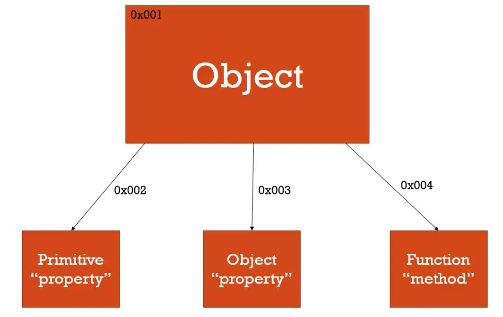

學習取用物件的屬性和方法。

<!-- more -->

### 物件的屬性與方法

在 JavaScript 中，物件與函式息息相關，因為**函式是一種特殊的物件**，兩者不應分開討論。

我們一再強調，物件就是 **Name/Value 的集合**，具有**屬性**和**方法**。

物件中的屬性指的是物件中的一組 Name/Value ，其 Value 屬於另一個**基本型別（純值）或物件型別**。

物件中的方法指的是物件中的一組 Name/Value ，其 Value 屬於另一個**函式**。

```javascript
var person = {
  // Property: 一組 Name/Value ，其中 Value 是'Fei'（純值）
  name: 'Fei', 
  // Property: 一組 Name/Value ，其中 Value 是一個物件。
  family: {
    dad: 'Jason',
    mom: 'Teresa',
    bro: 'Bai'
  },
  // Property: 一組 Name/Value ，其中 Value 是一個陣列，因為陣列也屬於物件的一種。
  friends: ['Shiba','giraffe','Fish'],
  // Method: 一組 Name/Value ，其中 Value 是一個函式，因為函式也屬於物件的一種。
  say: function(){
    console.log('Welcome to my blog!!') ;
  }
} ;
```

值得注意的是， JS 引擎創造物件時，除了**整個物件本身**會被儲存在一個**記憶體位置（Address）**，其中**所有的屬性或方法**也會分別被存進記憶體中。

當我們在存取、修改物件中的某一個屬性或方法時，其實 JS 引擎所指向的是儲存該屬性或方法的記憶體位置，而非整個物件儲存的記憶體位置。

只有當我們在取用整個物件時，JS 引擎才會指向儲存整個物件的記憶體位置。

物件、物件中的屬性與方法在記憶體中的儲存位置，對於傳值、傳參考的概念非常重要！

總而言之，可以用課程中的這張圖來總結物件的結構：



<hr>

### 屬性取用運算子

我們可以利用屬性取用運算子 `[]` 來存取物件內的屬性，或呼叫物件內的方法。記得呼叫函式都要以 `()` 來呼叫。

注意， `[]` 內要用**字串（String）**來表示我們想取用的屬性或方法名稱（Name）：

```javascript
console.log(person['name']) ; // Fei
console.log(person['family']) ; // { dad: 'Jason', mom: 'Teresa', bro: 'Bai'}
console.log(person['family']['bro']) ; // Bai
person['say']() ; // Welcome to my blog!!
```

除此之外，我們也可以用**物件專屬的取用運算子** `.` 來存取物件內的屬性或呼叫物件內的方法。與 `[]` 不同的是，我們不需要用字串來表示所欲取用的 name，因此使用上更為簡潔。

```javascript
console.log(person.name) ; // Fei
console.log(person.friends) ; // ['Shiba','giraffe','Fish']
console.log(person.friends[2]) ; // Fish
person.say() ; // Welcome to my blog!!
```

從 [MDN 所整理的運算子優先性表格](https://developer.mozilla.org/en-US/docs/Web/JavaScript/Reference/Operators/Operator_Precedence)中，可以發現 **`.` 運算子與 `[]` 運算子的優先次序是第二高的**，僅次於群組運算子 `()` ，且為左相依性，**由左至右**運算。

當然，我們也可以利用 `.` 運算子與 `[]` 運算子新增、修改物件的屬性或方法：

```javascript
person.hobby = ['Coding, Singing, Traveling'] ;
person['family'].sis = 'Mei' ;
person.say = function(){console.log('JS is so WEIRD!!')} ;
```

<hr>

### 結論
* 物件是 Name/Value 的集合 ，每一組鍵值配對都是一組屬性或方法。
* JS 創造物件時，會把物件整個存進一個記憶體位置，也會將每一個屬性或方法分別儲存進不同的記憶體位置。
* 我們可以用 `[]` 或 `.` 運算子新增、修改、取用物件的屬性或呼叫物件的方法。

### 參考資料
1. JavaScript 全攻略：克服 JS 奇怪的部分 4-30
