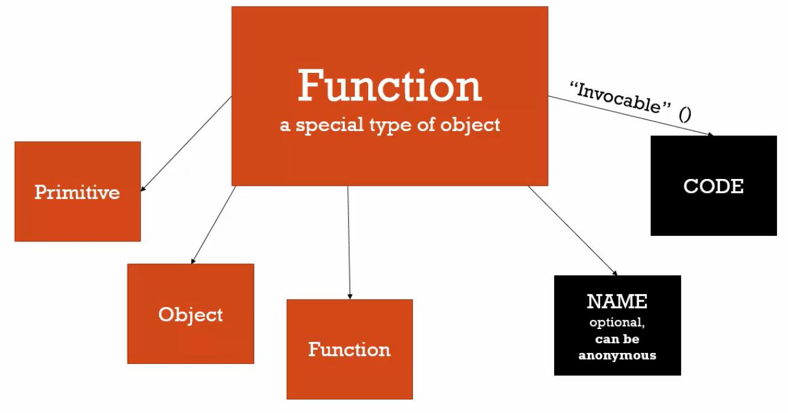

函式就是物件，物件就是函式，就是所謂一級函式。

<!-- more -->

### 函式就是物件

我們之前談到資料型別時，就已經提過：在 JavaScript 中，**函式是一種特殊的物件**。

也就是說，我們也可以賦予函式屬性以及方法：

```javascript
function personSay(){
  console.log('The function is an object in JavaScript!') ;
}

personSay.who = 'John' ;
personSay.age  = 28 ;
personSay.yell = function(){console.log('JS is Soooooo HARD!!')} ;

console.log(personSay.who) ; // John
personSay.yell() ; // JS is Soooooo HARD!!
```

而這樣的函式特色，在程式語言中被稱為**一級函式（First Class Functions）**。

<hr>

### 一級函式（First Class Functions）


Everything you can do with other types you can do with functions.
Assign them to variables, pass them around, create them on the fly.


上面這段對於一級函式的簡介意思是：任何你對其它型別做的事情，你都可以用一級函式做到。

蛤？好拗口？這是什麼意思？

意思就是，基本上，**你可以利用一級函式做任何事情！**包括將函式賦予給變數、將函式當作參數傳入另一個函式、利用實字語法建立函式、賦予函式屬性或方法等等。

現在聽起來很抽象，往後介紹**閉包（Closure）**時，就能夠深入理解一級函式的威力。

雖然一級函式並非 JavaScript 獨有的特色，但因為具備這樣的特性，使得 JavaScript 成為一種**以函式為核心（Functional Programming）**的程式設計語言。

<hr>

### 函式物件

在 JS 中，函式屬於一種特殊的物件，又稱為**函式物件**。

而物件本身是 Name/Value Pairs 的集合，因此函式物件可以擁有**屬性**或**方法**。

除了屬性或方法以外，函式物件還包括兩個我們不知道的特殊屬性：**名稱屬性（Name）**以及**程式屬性（Code）**。

函式物件的名稱屬性指的就是**函式名稱**。函式可以有名字，也可以沒有名字，沒有名字的函式又稱**匿名函式（Anonymous Function）**。

函式物件的程式屬性指的就是**函式程式區塊**，也就是 `{}` 內我們所寫的程式碼部分，而且，這個程式屬性是**能夠被呼叫的（Invocable）**，也就是在函式名稱後方加上 `()`。

```javascript
function yell(){
  console.log('JS is Soooooo WEIRD!!')
}
// yell 就是函式物件的名稱屬性
// {console.log('JS is Soooooo WEIRD!!')} 就是函式物件的程式屬性
// 利用 名稱屬性() 來呼叫執行程式屬性
yell() ; 
```

順便回顧一下，當我們呼叫函式後，會建立新的執行環境，以執行函式的程式區塊，也就是 `{}` 內的程式碼，而 `{}` 內的環境同時也是該函式中區域變數作用域的範圍。

課程以這張圖歸納了函式物件的組成：



<hr>

### 結論
* 在 JavaScript 中，函式是一種特殊的物件，而這樣的特色被稱為一級函式。
* 在 JavaScript 中，函式屬於函式物件，可以擁有屬性與方法。
* 函式物件的組成包括：名稱屬性（可以是匿名的）、程式屬性（能夠被呼叫的）、屬性、方法。

### 參考資料
1. JavaScript 全攻略：克服 JS 奇怪的部分 4-34
