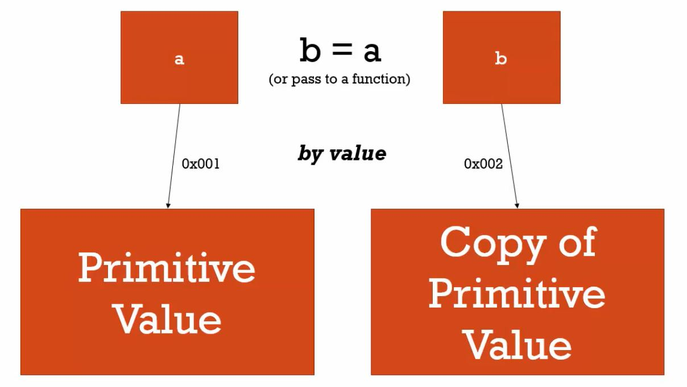
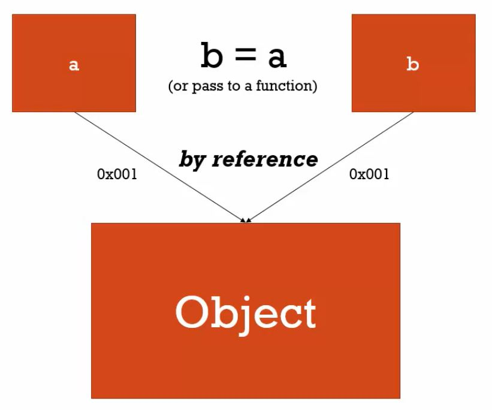

傳值 v.s. 傳參考， JavaScript 偷偷做但不告訴你的概念。

<!-- more -->

### 資料型別

回顧 JavaScript 的資料型別，可以分為兩大類，共七種。哪兩類？哪七種呀？

1. 基本型別類（Primitive）
  * String
  * Number
  * Boolean
  * Null
  * Undefined
  * Symbol
2. 物件型別類（Object）
  * Object (Function / Array)

其中，基本型別的六種值會以**純值**的方式表現，而物件型別中的**物件則是 Name/Value 的集合**，換句話說，**物件也是許多資料型別的集合。**

除此之外，我們也說過，當宣告新的變數或值（物件）時，JS 都會將這些資料型別分別存進記憶體，而變數在讀取值時，其實是參照的是值在記憶體中的位置（Address）。

搞懂上面這兩個觀念之後，傳值與傳參考的原理就呼之欲出了！

<hr>

### 傳值（by Value）

在 JavaScript 中，**基本型別（純值）**的變數賦值或拷貝大部分是以**傳值**的方式實現。

什麼意思？我們可以這樣解釋：因為基本型別本身就是**純值**，所以無論變數賦值，或是複製變數，大部分都是**傳遞（純）值**。

直接舉例說明：

```javascript
var a = 100 ;
var b = a ; // 複製變數
console.log(a,b) ; // 100 100
a = 200 ;　//  變數更新（重新賦值）
console.log(a,b) ; // 200 100
```

我們宣告變數 `a` 並賦值 `100` ，接著宣告變數 `b` ，並讓它的值等於 `a` 。此時，JS 引擎在複製變數 `a` 的值時，會傳遞值 `100` 並賦予給變數 `b` ，使變數 `b` 值也等於 `100`。（如第 3 行結果）

如果我們接著修改變數 `a` ，賦值 `200` ，此時變數 `a` 更新後的值等於 `200`，而變數 `b` 的值仍然是 `100`，並沒有改變。

也就是說，基本型別在賦予變數值、複製變數或更新（重新賦值）變數時，JS 引擎會參照到該值在記憶體中的位置，並傳遞值本身，**為複製的變數建立一個新的記憶體位置來儲存傳遞的值**。

所以，在上面這段範例中，第 2 行執行後，變數 `a` 和變數 `b` 雖然都是 `100` ，但這**兩個變數所參考的記憶體位置並不一樣**，以致修改變數 `a` 後，變數 `b` 不受影響。

課程中以這張圖來說明傳值的概念：



<hr>

### 傳參考（by Reference）

在 JavaScript 中，**物件型別（物件、函式、陣列）**的變數賦值或拷貝大部分是以**傳參考**的方式實現。

同樣的思維，我們可以這樣解釋：因為物件型別本身就是**物件（許多資料型別的集合）**，所以無論變數賦值，或是複製變數，大部分都是**傳遞參考（物件）**。

什麼是**參考**？也就是變數所參考到**儲存物件的記憶體位置（Address）**。因此，傳參考又稱為**傳址**。

請看下方範例：

```javascript
var a = {
  name: 'Fei',
  age: 23
} ;
var b = a ; // 複製變數
console.log(a,b) ; // {name: "Fei", age: 23} {name: "Fei", age: 23}
a.age = 17 ;　//  變數更新（重新賦值）
console.log(a,b) ; // {name: "Fei", age: 17} {name: "Fei", age: 17}
```

由於物件**傳參考**的特性，第 5 行執行後，變數 `a` 和變數 `b` 這**兩個變數所參考的記憶體位置是相同的**，都指向儲存物件 `{name: "Fei", age: 23}` 的位置。

也就是說，物件型別在賦予變數值、複製變數或更新（重新賦值）變數時，JS 引擎會參照到該物件在記憶體中的位置，並傳遞參考位置，**複製的變數會同樣參考到物件儲存的記憶體位置**。

換句話說，物件並不像純值那樣會被複製到新的記憶體位置中。背後的真相是：**物件不會被複製（新建記憶體位置儲存）**。

是以，第 7 行執行後，修改變數 `a` 物件裡的 `age` 值，等同修改了變數 `b` 物件裡的 `age` 值，因為變數 `a` 和變數 `b` 這兩個變數所參考的記憶體位置是相同的，指的是同一個物件。

其實，我們也曾經說過，JavaScript 物件中的每個 Name/Value 都各自擁有不同的記憶體位置，既然如此，我們可以想成：儲存物件的記憶體位置，該物件在取用屬性或方法時，也會參考到儲存其所擁有的 Name/Value 的記憶體位置。

因此，我們必須將物件視為一個**實體（Instance）**，當我們更新物件裡的屬性或方法時，**修改（Mutate）**的正是 Name/Value 記憶體位置的**值**，這當然會更動到所有參考到該物件實體的變數。

或許是考量效率問題，JS 在更新或複製變數時，若碰到物件資料，會以傳參考（指向相同記憶體位置）的方式實現。試想，如果要像純值那樣複製值本身，倘若物件擁有上百個 Name/Value Pairs 該怎麼辦？效率肯定會變差。那直接指向相同物件（的記憶體位置）不更省事？

因為物件是 Name/Value 的集合，也是儲存 Name/Value 記憶體位置的集合。

最後，還有一個觀念：**物件被傳入函式中執行，同樣擁有傳參考的特性**。

```javascript
var a = {
  name: 'Fei',
  age: 23
} ;
var b = a ;

function mutateProperty(obj){
  obj.age = 17 ; // 修改物件的屬性
}
mutateProperty(a) ;
console.log(a,b) ; // {name: "Fei", age: 17} {name: "Fei", age: 17}
```

課程以這張圖來說明傳參考的概念：



<hr>

### 結論
* 在 JS 中，基本型別（純值）在賦予變數值、複製變數或更新（重新賦值）變數時，JS 引擎會參照到該值在記憶體中的位置，並傳遞值本身，為複製的變數建立一個新的記憶體位置來儲存傳遞的值。
* 在 JS 中，物件型別（物件、函式、陣列）在賦予變數值、複製變數或更新（重新賦值）變數時，JS 引擎會參照到該物件在記憶體中的位置，並傳遞參考位置，複製的變數會同樣參考到物件儲存的記憶體位置。此外，物件被傳入函式中執行也擁有傳參考的特性。
* 變數賦值、複製或更新（重新賦值），可以歸納到使用賦值運算子 `=` 的情境，此時純值會傳值，物件會傳參考。
* 賦值運算子 `=` 的意義在於，若賦值資料是第一次宣告，則 JS 會新建記憶體位置儲存該資料，並賦值給左方變數。
* 傳值或傳參考的歸納符合大部分的狀況，但有例外，且目前學界對於 JS 究竟是傳值、傳參考還是傳享（by Sharing）？並無定論，有興趣的人可以進一步參考下方資料文章。

### 參考資料
1. JavaScript 全攻略：克服 JS 奇怪的部分 4-36
2. [重新認識 JavaScript: Day 05 JavaScript 是「傳值」或「傳址」？](https://ithelp.ithome.com.tw/articles/10191057)
3. [深入探討 JavaScript 中的參數傳遞：call by value 還是 reference？](https://blog.techbridge.cc/2018/06/23/javascript-call-by-value-or-reference/)

