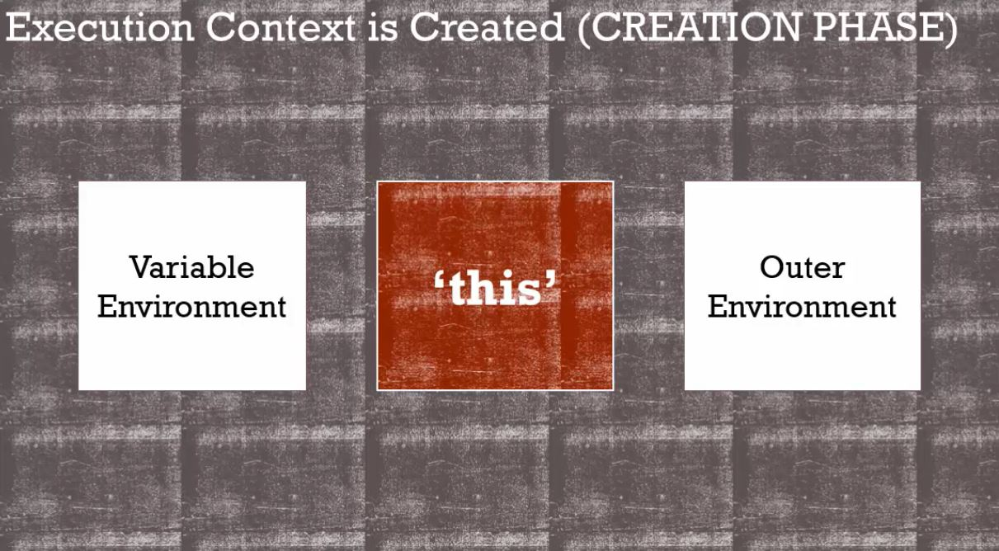

你指的 this 到底是哪個 this ？

<!-- more -->

### 回顧函式的執行環境

經過前面一連串的講解，我們知道，當一個函式被呼叫後，JS 引擎會為該函式創造屬於它的**執行環境**。而執行環境本身就是該函式中區域變數的**變數環境**，也就是**作用域的範圍**。我們還可以依據函式所處的**詞彙環境**，判斷函式執行時，如果找不到所需的變數，JS 會參考到的**外部環境**為何。

除此之外，當新的函式執行環境被創造時，JS 引擎也會幫我們建立一個新的變數 `this` 。

課程歸納如下：



在第 03 篇介紹全域環境時，我們說過，全域環境就是全域物件 `window` ，此時變數 `this` 指的就是全域物件。

```javascript
var a = 5566 ;
console.log(window) ;
console.log(this) ;
console.log(window.a === this.a) ; // true
```

但是，當函式被呼叫後，在該函式的執行環境中，變數 `this` 所代指的對象是會改變的。

So, what is "this" ?

<hr>

### this


In most cases, the value of this is determined by **how a function is called**. (MDN)


`this` 是一個**變數**（代名詞），在一個函式被呼叫時，它會在新的執行環境中被建立，而 `this` 所指涉的對象取決於**該函式如何被呼叫**。

什麼樣的情況叫做**如何被呼叫**？

有個簡單的法則是：在**大部分**的狀況下，我們可以透過**函式被誰呼叫**來判斷`this` 所代指的對象。

簡言之，`this` 會指向**呼叫該函式的物件**。

雖然這個法則適用於大部分狀況，但**有例外**。

#### 純粹呼叫（Simple Call）

我們用程式碼舉例說明，首先，以全域為例：

```javascript
function a(){
  console.log(this) ; // window
}
var b = function(){
  console.log(this) ; // window 
}
a() ; 
b() ;
```

我們會發現，呼叫函式 `a` 與函式 `b` 後，在兩者的執行環境中，變數 `this` 都會指向全域物件 `window` 。

因為，在這個例子，函式 `a` 與函式 `b` 都是**被全域物件呼叫**的，所以 `this` 會代指全域物件 `window` ，這樣看或許比較清楚：

```javascript
window.a() ; 
window.b() ;
```

接著，我們把函式 `b` 放進函式 `a` ：

```javascript
var name = 'Bai'

function a(){
  console.log(this.name) ; // Bai
  var name = 'Fei'
  
  var b = function(){
    console.log(this.name) ; // Bai 
  }

  b() ;
}
a() ; 
```

此時我們會發現，儘管函式 `b` 在函式 `a` 中被呼叫，但函式 `a` 與函式 `b` 中的 `this` 都指向全域物件 `window`，因此會取用到 `Bai`。

為什麼？~~老實說，我也不清楚。~~只能說，JavaScript 的設計就是這樣（？）

我的解釋是：雖然函式 `b` 在函式 `a` 中，但**呼叫函式 `b` 的依舊是全域物件 `window`** ，仔細觀察， `b()` 並**沒有被誰呼叫**，因此 `this` 依然指向 `window`。

像這樣直接呼叫函式，被稱為**純粹呼叫（Simple Call）**，此時變數 `this` 都會指向全域物件 `window`。

那什麼叫**做被誰（物件）呼叫**？

#### 呼叫物件方法（Call Object Method）

**呼叫物件方法（Call Object Method）**，就是函式被物件呼叫：

```javascript
var name = 'Bai' ;
var person = {
  name: 'Fei',
  say: say // 物件裡的 name/value 其中的 value 為函式，就屬於物件的方法。
}
function say(){
  console.log(this.name) ;
}

say() ; // Bai 
person.say() ; // Fei 
```

同理， `say()` 被全域物件呼叫（可以看成 `window.say()` ），所以 `this.name` 等同於 `window.name` ，讀到的值為 `Bai`。

而 `person.say()` ，呼叫函式 `say` 的物件就是它前面的物件 `person` ，也就是說，在函式 `say` 執行時，其執行環境內所創造的 `this` 會指向呼叫函式 `say` 的物件 `person` ，所以 `this.name` 等同於 `person.name` ，讀到的值就會是 `Fei` 。

你可能會覺得，咦？可是物件 `person` 的方法 `say` 是參考全域物件中的函式 `say`，但這和 `this` 無關，**`this` 指涉的對象只取決於哪一個物件呼叫該函式**。

#### 純粹呼叫與呼叫物件方法

最後，我們結合純粹呼叫和呼叫物件方法的例子：

```javascript
var person = {
  name: 'Fei',
  greet: function(){
    function reviseName(newName){
      this.name = newName ;
    }
    reviseName('Foo') ; // 儘管處在函式 greet 裡，但仍屬於純粹呼叫，this 代指 window。
    console.log(this.name) ; // Fei　
  } 
}
person.greet() ; 
console.log(name) ; // Foo　；全域物件會新增一個變數 name ，其值為 Foo 。
```

同樣的道理，許多人看到函式 `reviseName` 處在物件 `person` 中，就誤解函式 `reviseName` 裡面的 `this` 也會指向物件 `person` ，但**並不是**，因為 **`this` 指涉的對象取決於函式如何被呼叫**， `this` 在函式執行後才會出現作用，跟函式本身在哪裡被宣告沒有關係，這點要特別小心。

是以，在這個例子中，函式 `reviseName` 被純粹呼叫，其 `this` 代指的就會是全域物件 `window` ，會在全域中新增一個變數 `name` 其值為 `Foo` 。

如果要達到修改物件 `person` 中 `name` 的目的，我們可以利用執行環境中變數作用域以及範圍鍊的特性，在函式 `greet` 中**宣告新的變數（通常會命名為 `self` 或 `that` ），並賦予 `this` 的值**： `person`（在函式 `greet` 中 `this` 代指 `person`），讓子函式 `reviseName` 可以向外參考取用到該變數，以修改物件 `person` 中的 `name` 。

方法如下：

```javascript
var person = {
  name: 'Fei',
  greet: function(){
    var self = this ;
    function reviseName(newName){
      self.name = newName ;
    }
    reviseName('Foo') ; 
    console.log(self.name) ; // Foo 
  } 
}
person.greet() ;
```

弄懂 this 在純粹呼叫與物件方法呼叫上的指涉差異，我們就能判斷大部分情況 this 代指的對象了。

由於 this 的例外狀況還有很多，詳細請容我日後再介紹，有興趣的朋友可以先閱讀參考資料中的大神文章，對 this 的理解會更加深刻。

<hr>

### 結論
* `this` 是一個變數（代名詞），在一個函式被呼叫時，它會在新的函式執行環境中被建立。
* 在**大部分**的狀況下，`this` 會指向呼叫該函式的物件，但有例外狀況。
* 當函式被純粹呼叫時，`this` 都會指向全域物件 `window` 。
* 當函式被物件呼叫（呼叫物件方法）時，`this` 會指向呼叫該函式的物件。

### 參考資料
1. JavaScript 全攻略：克服 JS 奇怪的部分 4-37
2. [MDN：this](https://developer.mozilla.org/en-US/docs/Web/JavaScript/Reference/Operators/this)
3. [重新認識 JavaScript: Day 20 What's "THIS" in JavaScript (鐵人精華版)](https://ithelp.ithome.com.tw/articles/10193193)
4. [淺談 JavaScript 頭號難題 this：絕對不完整，但保證好懂](https://github.com/aszx87410/blog/issues/39)
5. [卡斯伯：鐵人賽：JavaScript 的 this 到底是誰？](https://wcc723.github.io/javascript/2017/12/12/javascript-this/)

