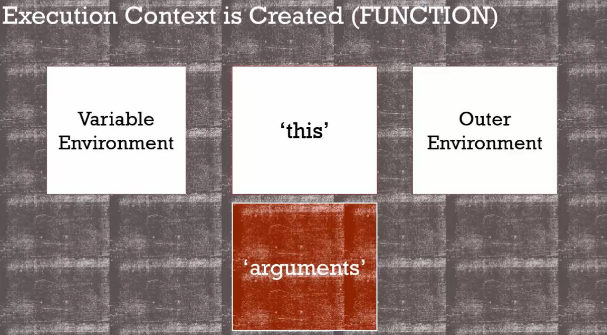

函式的參數（Parameter）和參數 `arguments` 有什麼關係？

<!-- more -->

## 參數（Parameter）
---

當我們在宣告函式時，會定義所需帶入的數值，也就是 `()` 裡面的變數，這個被丟進函數裡的數就是所謂的**參數（Parameter）**。

```javascript
// a 和　b 就是函式的參數
function calc(a, b){
  console.log(a * b) ;
}

calc(55, 66) ; // 55 和 66 就是函式 calc 的參數
```

## 參數（Arguments）
---

而在 JavaScript 中有一個關鍵字也叫作**參數： `arguments`**，它跟變數 `this` 一樣，在函式執行後被創造，指的是**函式執行環境裡，那些被丟進來的參數們**。




> The parameters you pass to a function.
> JavaScript gives you a keyword of the same name which contains them all.


簡單來說，`arguments` 就是**函式參數的集合**，它會以**類陣列（Array-like）**的形式存在於函式執行環境中，供我們取用。

```javascript
function calc(a, b){
  console.log(arguments) ; // Arguments(2):[55, 66]
}

calc(55, 66) ;
```

必須謹記！ `arguments` 是**類陣列**，而不是陣列。雖然它擁有部分陣列的特性，但**大多數陣列可以使用的方法， `argument` 都不能使用**。

不過，我們可以透過**取用運算子 `[]`** 來取用 arguments 裡的某一個參數。

```javascript
function calc(a, b){
  console.log(arguments[1]) ; 66
}

calc(55, 66) ;
```

在 JavaScript 中，我們可以設定函式所欲代入的參數，但真正執行時卻不一定要代入參數，這不會導致 JS 報錯。

當我們執行函式並代入參數時，必須**由左至右**逐一代入定義的參數，任意跳過都是不被 JS 接受的。

如果沒有參數被丟進函式，JS 引擎仍會執行函式，由於變數 Hoisting 的特性，沒有代入的參數會自動被定義成 `undefined` 。

```javascript
function calc(a, b, c){
  console.log(a) ; 
  console.log(b) ; 
  console.log(c) ; // undefined
  console.log(arguments) ; // Arguments(2):[55, 66]
}
calc(55, ,66) ; //  SyntaxError: Unexpected token
calc(55, 66) ; 
```

在 ES6 之後，我們可以在宣告函式時**設定參數的預設值**，或直接在函式區塊內透過邏輯運算子 `||` 設定預設值，避免 `undefined` 。

```javascript
function calc(a, b, c=100){
  b = b || 66 ;
  console.log(a) ; 
  console.log(b) ; 
  console.log(c) ; // 100
  console.log(a * b * c) ; 
}
calc(55) ; 
```

我們可以利用 `arguments.length` 的方法來**判斷傳入參數的數量**或參數是否為 `undefined`：

```javascript
function calc(a, b, c=100){
  if(arguments.length === 0){
    return ; // 結束函式(不做任何事)
  }
  console.log(a * b * c) ; 
}
calc() ; 
```

在 ES6 以後，我們可以透過**展開運算子（Spread Operator） `...`** 將陣列中的值逐一展開後丟進函式中處理：

```javascript
const nums = [1, 2, 3] ;
function calc(a, b, c){
  console.log(a * b * c) ; // 6
}
calc(...nums) ; 
```


## 結論
---
* 函式被呼叫後，JS 引擎會自動幫我們宣告一個變數 `arguments` 。
*  `arguments` 是函式參數的集合，會以類陣列的形式存在於函式執行環境中供我們取用。

## 參考資料
---
1. JavaScript 全攻略：克服 JS 奇怪的部分 3-39

