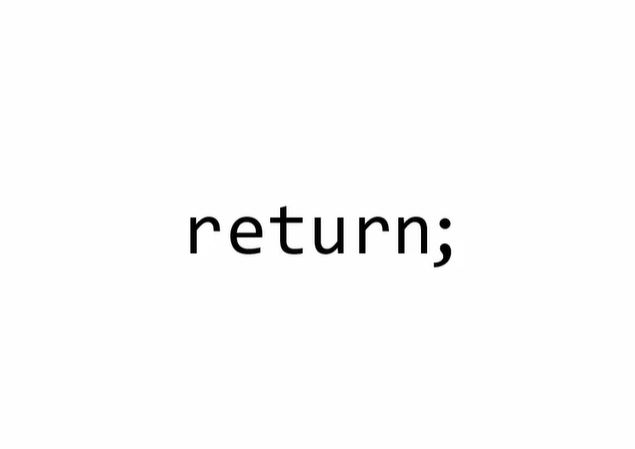

再強調一次，什麼是語法解析器？

<!-- more -->

## 語法解析器（Syntax Parsers）
---

我們在第 01 篇解釋道，語法解析器會幫助我們解析程式碼，並轉換成電腦看得懂的語言（指令），讓電腦執行。

也就是說，我們所寫的程式碼並非由電腦直接執行，會先經過語法解析器轉譯，如果沒有語法錯誤，再由電腦執行我們所寫的程式碼。

語法解析器是 JavaScript 引擎中的一部分，它會一個字一個字解析我們所寫的程式碼，譬如看到 `r` ，它會預期接著 `e` 、 `t` 、 `u` 、 `r` ' `n`， 也就是 `return` ，並解析為 `回傳` 指令，接著預期接下來會出現一串表達式，直到碰到**分號 `;` （Semicolon）**，表示該段落解析結束。如果中間拼字有誤，就會出現 `SyntaxError` 。

在執行程式碼之前，想像語法解析器會**按照規則**，逐字逐行地幫我們解讀程式碼，轉換成電腦能夠理解的語言，且如果需要的話，語法解析器會自己幫我們改變程式碼，以利引擎執行。

無論是哪一種程式語言，理解語法解析器的邏輯與規則，對開發者來說非常重要。

## 結論
---
* 語法解析器會幫助我們解析程式碼，並轉換成電腦看得懂的語言後，讓電腦執行程式碼。
* 在執行程式碼之前，想像語法解析器會按照規則，逐字逐行地幫我們解讀程式碼，並轉換成電腦能夠理解的語言，且如果需要的話，語法解析器會自己幫我們改變程式碼，以利引擎執行。

## 參考資料
---
1. JavaScript 全攻略：克服 JS 奇怪的部分 4-41

