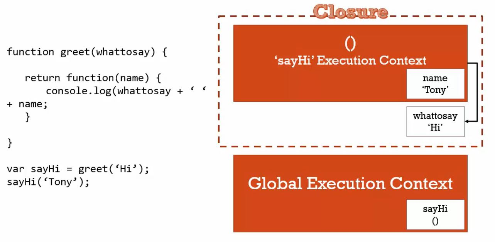

學了這麼多，現在我們來嘗試理解 JS 小魔王：閉包。

<!-- more -->

### 一級函式

JavaScript 擁有一級函式的特性，**函式（Function）屬於特殊的函式物件，可以被視為一種資料型態**。

所以，我們透過函式 `return` 另一個函式，並連續呼叫、執行，就像這樣：

```javascript
function greet(whattosay){
  
  return function(name){
    console.log(whattosay + ' ' + name) ;
  }
}

greet('Hello!')('John') ;
```

把函式想像成模板，我們可以傳入所欲的參數，並將它賦值給一個變數，再利用該變數呼叫函式。

```javascript
function greet(whattosay){
  
  return function(name){
    console.log(whattosay + ' ' + name) ;
  }
}

var sayHola = greet('Hola!') ;
var sayHello = greet('Hello!') ;

sayHola('John') ;
sayHello('John') ;
```

當 JS 讀到 `var sayHola = greet('Hola!') ;` 時，它會創造函式 `greet(whattosay)` 的執行環境，將 `'Hola!'` 作為參數傳入，並回傳匿名函式 `function(name)` 賦值給變數 `sayHola` ，最後消滅函式 `greet(whattosay)` 的執行環境。 

咦？等等，有沒有覺得怪怪的？

既然函式 `greet(whattosay)` 的執行環境已經消滅，為什麼 JS 讀到 `sayHola('John')` 的時候，JS 還記得 `function(name)` 裡的 `whattosay` 指的是 `'Hola!'` ？

同理，為什麼 JS 讀到 `sayHello('John') ;` 的時候，JS 還記得 `function(name)` 裡的 `whattosay` 指的是 `'Hello!'` ？

之前我們不是說，函式裡的**區域變數（Local Variable）**，會隨著函式執行環境生滅嗎？

<hr>

### 函式的執行環境

我們不斷強調，當一個函式被呼叫後，JS 會創造屬於該函式的執行環境，並**分配一小部分的記憶體空間給該函式使用**。

換句話說，**每個函式的執行環境都有屬於自己的記憶體空間**。我們所傳入的**參數**，或是在函式裡創造的**變數（純值或物件）**都會被儲存在該函式專屬的記憶體空間裡面，和其他函式無關，也和全域環境無關。

當函式執行完畢，執行環境被消滅後，基本上， JavaScript 引擎會清除該函式專屬的記憶體空間，這個動作被稱為[垃圾回收（Garbage Collection）](https://developer.mozilla.org/zh-TW/docs/Web/JavaScript/Memory_Management  )。

然而，**儲存該函式參數和區域變數的記憶體空間並仍會存在**，並不會被清除，這是 JS 引擎本身設計的特色，為了範圍鍊中變數的參考與取用。

在上面的例子中， JS 引擎在 `function(name)` 裡面找不到 `whattosay` ，所以它透過**範圍鍊**向**外部（詞彙）環境** `greet(whattosay)` 尋找可用的變數。在 `greet(whattosay)` 中，儘管函式 `greet(whattosay)` 的執行環境已經消滅，可是， JS 引擎**仍會保留儲存該函式參數和區域變數的記憶體空間**，所以，JS 會取用到 `whattosay` ，等於傳入的參數 `'Hola!'`。

由此可見，`sayHola('John') ;` 的執行結果為 `Hola! John` 。 

<hr>

### 閉包（Closure）

閉包，指的是**利用函式執行環境，創造一個封閉空間，包住可供取用的變數**。

閉包是我們巧用 **JS 引擎會保留儲存函式參數與區域變數的記憶體空間**的特性所產生的方法，可以幫助我們**提升函式彈性**、**避免污染全域變數**。

如同上述的例子，我們利用函式 `greet(whattosay)` 創造執行環境，傳入參數 `whattosay` 的值（`'Hola!'` 或 `'Hello!'`），並回傳另一個函式，供我們調用內部儲存的參數或區域變數。

在課程中利用這張圖來解釋閉包的範例：



<hr>

### 結論
* 當一個函式被呼叫後，JS 會創造屬於該函式的執行環境，並分配一小部分的記憶體空間給該函式使用。
* 當函式執行完畢，執行環境被消滅後，儲存該函式參數和區域變數的記憶體空間並仍會存在，並不會被清除。
* 閉包，指的是利用函式執行環境，創造一個封閉空間，包住可供取用的變數。

### 參考資料
1. JavaScript 全攻略：克服 JS 奇怪的部分 4-47
