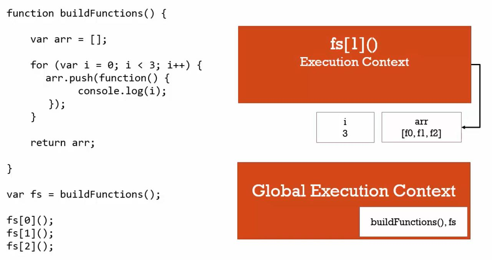

這題沒答對，你敢說你懂閉包？

<!-- more -->

### 閉包概念的程式碼範例

請看下面這段程式碼，想一想這段程式碼在做什麼？

你認為 `fs[0]()` 、 `fs[1]()` 、 `fs[2]()` 執行後，分別會印出什麼數字？

請將答案紀錄在一張白紙上，再複製貼上這段程式碼至瀏覽器中，檢驗是否正確。

```javascript
var fs = buildFunctions() ;

function buildFunctions(){
  var arr = [] ;

  for(var i = 0 ; i < 3 ; i++){
    arr.push(function(){
      console.log(i)
    })
  }

  return arr ;
}

fs[0]() ;
fs[1]() ;
fs[2]() ;
```

檢驗後答案如你所預期的一樣嗎？如果你答對的話，恭喜你（應該）已經掌握閉包的概念了！

解釋這個例子的原理之前，有必要畫個防雷分隔線：

.

.

.

.

.

.

沒錯，在這個例子中， `fs[0]()` 、 `fs[1]()` 、 `fs[2]()` 執行後，印出的結果都是 `3` 。

許多人預期 `fs[0]()` 、 `fs[1]()` 、 `fs[2]()` 會分別印出 `0` 、 `1` 、 `2` ，怎麼會是 `3` ？這數字哪來的？

簡單來說，這是因為：當你在**執行** `fs[0]()` 這三個函式的時候，它們所參考的外部（詞彙）環境 `buildFunctions()` 所儲存的區域變數 `i` ，已經是 `3` ，和你**創造** `fs[0]()` 這三個函式的時候的 `i` 是不一樣的。 


還是不懂？沒關係，不用害怕，繼續跟我往下走。

<hr>

### 範例解析

綜合過去的觀念，我們一步一步拆解這段程式碼在幹嘛。

首先，在 JS 執行程式碼之前，它會做兩件事，你還記得嗎？

**Creation**： JS 引擎會創造全域執行環境、 `window` 物件，以及 `this` 變數（代指 `window` 物件）。

**Hoisting**： JS 引擎會將變數宣告與函式宣告儲存進記憶體空間，即創造全域變數與全域函式。在這個例子中，變數 `fs` 會先被創造並賦值為 `undefined` ，而函式 `buildFunctions()` 會被宣告完成。

接著， JS 引擎才會真正開始執行程式碼。而第一行程式碼是：

```javascript
var fs = buildFunctions() ;
```

這行程式碼的意思是：


呼叫函式 buildFunctions ，並將執行後 return 的值賦予給變數 fs 。



所以，我們接著要理解函式 `buildFunctions` 到底執行了什麼？

```javascript
function buildFunctions(){
  var arr = [] ;

  for(var i = 0 ; i < 3 ; i++){
    arr.push(function(){
      console.log(i)
    })
  }

  return arr ;
}
```

函式 `buildFunctions` 被呼叫後，**JS 引擎會創造屬於它的執行環境**，並開始執行 `{}` 內部的程式碼（也就是函式物件的程式屬性）。

宣告一個區域變數 `arr` 為一個空陣列 `[]`：

```javascript
  var arr = [] ;
```

跑一個 `for` 迴圈，若符合條件就執行迴圈內容，反之則結束迴圈：

```javascript
  for(var i = 0 ; i < 3 ; i++){
    arr.push(function(){
      console.log(i)
    })
  }
```

在 `for` 迴圈這部分，我們宣告一個區域變數 `i = 0` 當作計數器，若 `i < 3`，就執行 `for {}` 內的程式碼，反之則跳出迴圈。

每次在 `for {}` 裡面，我們要**創造**一個新的函式 `function(){console.log(i)})` ，並將它 `push` 到變數 `arr` 陣列裡面。

什麼？你說陣列裡面放函式很怪？忘記我們之前說過：陣列是任何東西的集合，可以存放任何純值或（函式）物件。

我們將每一次迴圈的步驟拆開看：

第一次迴圈時， `i = 0` ， `0 < 3` ，符合條件，執行迴圈內容：**創造**函式 `function(){console.log(i)})` 並 `push` 到 `arr` 陣列中，接著 `i ++` 。 

第二次迴圈時， `i = 1` ， `1 < 3` ，符合條件，執行迴圈內容：**創造**函式 `function(){console.log(i)})` 並 `push` 到 `arr` 陣列中，接著 `i ++` 。 

第三次迴圈時， `i = 2` ， `2 < 3` ，符合條件，執行迴圈內容：**創造**函式 `function(){console.log(i)})` 並 `push` 到 `arr` 陣列中，接著 `i ++` 。 

第四次迴圈時， `i = 3` ， `3 < 3` ，不符合條件，跳出迴圈， `for` 迴圈結束。

此時，區域變數 `arr` 為一個陣列，裡面包括三個函式（物件），而區域變數 `i = 3` 。

回傳變數 `arr` 陣列：

```javascript
  return arr ;
```

至此，函式 `buildFunctions` 執行完畢，**JS 引擎會消滅屬於它執行環境**。

但是！上篇我們有說，**JS 引擎會保留儲存函式參數與區域變數的記憶體空間**，也就是說，**區域變數 `arr` 和 `i` 仍會存於該函式專屬的記憶體空間，並不會消滅**。

回到全域執行環境，函式 `buildFunctions` 執行後回傳變數 `arr` 陣列，並賦值給變數 `fs` 。

因此 `fs = arr` 。（想一想，是傳值？還是**傳參考？**） 

終於來到最後一步：

```javascript
fs[0]() ;
fs[1]() ;
fs[2]() ;
```

依序呼叫變數 `fs` 裡的三個函式並**執行**。 


 `fs[0]` 、 `fs[1]` 、 `fs[2]` 三個函式都指向函式 `function(){console.log(i)})` ，以 `fs[0]()` 為例，JS 執行後，會創造其專屬的執行環境，並開始執行程式：

```javascript
function(){
  console.log(i)
}
```
JS 引擎知道要執行 `console.log(i)` ，於是開始在函式 `function(){console.log(i)})` 裡面找 `i`，但很顯然，它找不到（因為沒有定義），所以它只好依照**範圍鍊**的規則，向**外部（詞彙）環境**尋找可以取用的 `i` 。

外部詞彙環境是誰？想一想，我們在哪裡**創造**函式 `function(){console.log(i)})` ？

沒錯！就是在函式 `buildFunctions` 裡面！

```javascript
function buildFunctions(){
  var arr = [] ;

  for(var i = 0 ; i < 3 ; i++){
    arr.push(function(){
      console.log(i)
    })
  }

  return arr ;
}
```

所以，JS 引擎會參考外部（詞彙）環境函式 `buildFunctions` 裡的區域變數 `i` 。

此時 `i` 是多少？ `i = 3` 。

按此邏輯， `fs[0]()` 、 `fs[1]()` 、 `fs[2]()` 印出的結果當然都會是 `3` 了。

<hr>

### 創造函式 v.s. 執行函式 

有些人之所以預期執行結果為 `0` 、 `1` 、 `2` ，那是因為混淆**創造函式**和**執行函式**的時機與差異。

其實，我認為只要釐清**創造函式**和**執行函式**的時機與差異，閉包的原理就很清晰了。

在這個例子中，**創造函式** `function(){console.log(i)})` 的時候，就只是**單純創造該函式**而已，並不會將外部環境的變數 `i` 一起存進記憶體。

等到**執行函式**時， JS 引擎在函式執行環境 `function(){console.log(i)})` 中找不到可用的 `i`（因為它函式內部本身並沒有宣告 `i` 值），所以它會依照範圍鍊，向外部詞彙環境參考可用的值。

**外部詞彙環境**，指的就是，我們在哪裡**創造**函式？或說，函式被我們寫在哪裡？

綜合 JS 種種的特性，形成了閉包的原理：**利用函式執行環境，創造一個封閉空間，包住可供取用的變數**。而那些在範圍鍊中可供取用的變數，又稱為**自由變數（Free Variable）**

總而言之，分清楚**創造（宣告）函式**與**執行（呼叫）函式**的時機以及差異，有助於理解閉包的原理，因為閉包就是綜合這些概念而來。

課程中用這張圖來解釋本篇範例的運作原理：



<hr>

### 結論
* 分清楚創造函式與執行函式的時機以及差異，有助於理解閉包的原理。
* 創造函式時， JS 引擎會創造該函式的記憶體空間，並儲存函式內宣告的變數，並不會將外部環境的自由變數一起存進記憶體（除非以參數傳入）。
* 執行函式時， JS 引擎如果在函式執行環境中找不到可取用的值，它會依照範圍鍊向外部詞彙環境參考可用的值，直到找到為止。
* 閉包的原理就是：利用函式執行環境，創造一個專屬的封閉空間（記憶體空間），包住可供取用的變數。
* 自由變數指的是：函式在範圍鍊中可供取用的變數。

### 參考資料
1. JavaScript 全攻略：克服 JS 奇怪的部分 4-47