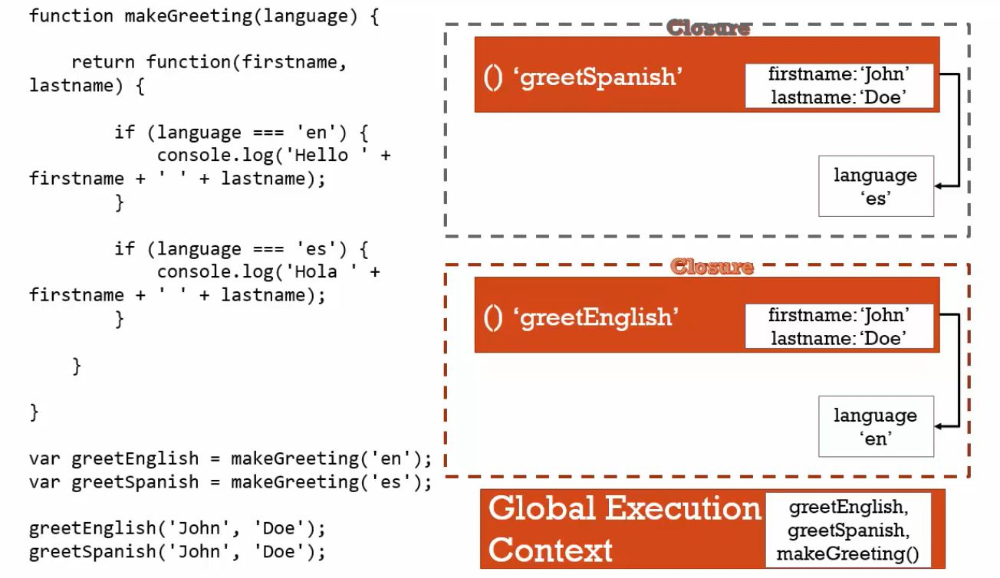

透過閉包的原理，搭建一座座函式工廠吧！

<!-- more -->

## 函式工廠（Function Factory）
---

現在，我們已經瞭解閉包的概念，那麼，在什麼樣的情況下，我們會使用閉包？

再重新檢視閉包的原理：利用**函式執行環境**，創造一個**專屬的封閉空間（記憶體空間）**，**包住可供取用的變數**。

我們可以試著從閉包原理的特色去推想使用情境：

1. 避免污染全域變數
2. 製作客製化的函式

函式工廠，指的就是利用閉包，來協助我們製作函式化的函式，提升程式碼的編撰彈性。

什麼意思？以下面這段程式碼為例：

```javascript
var greetEnglish = makeGreeting('en') ;
var greetSpanish = makeGreeting('es') ;

function makeGreeting(language){
  
  return function(firstname, lastname){
    
    if(language === 'en'){
      console.log('Hello! ' + firstname + ' ' + lastname) ;
    }

    if(language === 'es'){
      console.log('Hola! ' + firstname + ' ' + lastname) ;
    }
  }
}

greetEnglish('Fie', 'Lu') ;
greetSpanish('Fei', 'Lu') ;
```

看懂了嗎？我們可以利用函式 `makeGreeting(language)` 來客製化不同語系回應的函式，只要傳入我們想要得到的語系參數 `language` 即可，有別於過去，我們還要針對不同語系一個一個宣告相對應的函式，大幅減少我們撰寫重複程式碼的時間。

在這裡，函式 `makeGreeting(language)` 就像一座**工廠**，利用**其函式執行環境**，創造一個**專屬的封閉空間（記憶體空間）**，**包住可供取用的變數**（也就是參數 `language` ），並依據條件回傳不同的函式，而有不同的執行結果。

而之所以可以這樣做，這是因為 `makeGreeting('en')` 與 `makeGreeting('es')` 執行後，各自創造了自己的函式執行環境，也各自擁有屬於自己的記憶體空間，以儲存參數 `language` 的值 `en` 和 `es` ，讓 `return` 的 `function(firstname, lastname)` 能夠依照範圍鍊向外部詞彙環境參考 `language` 的值，根據 `if` 判斷條件的差異，印出不同語系的招呼語：`'Hello!'` 或是 `'Hola!'`。

在課程中，講師用這張圖來說明此例函式工廠的閉包原理：




## 結論
---
* 閉包的原理：利用函式執行環境，創造一個專屬的封閉空間（記憶體空間），包住可供取用的變數。
* 函式工廠指的就是利用閉包原理，把一個函式看成一個工廠，依據計算或變數判斷創造另一個函式，回傳供我們取用。

## 參考資料
---
1. JavaScript 全攻略：克服 JS 奇怪的部分 4-48


