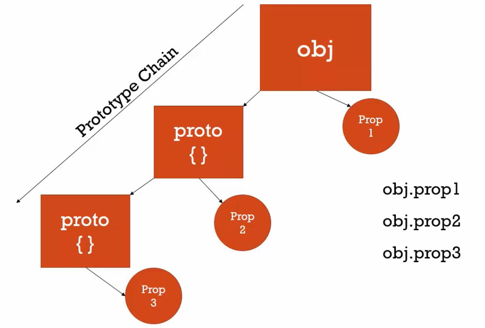
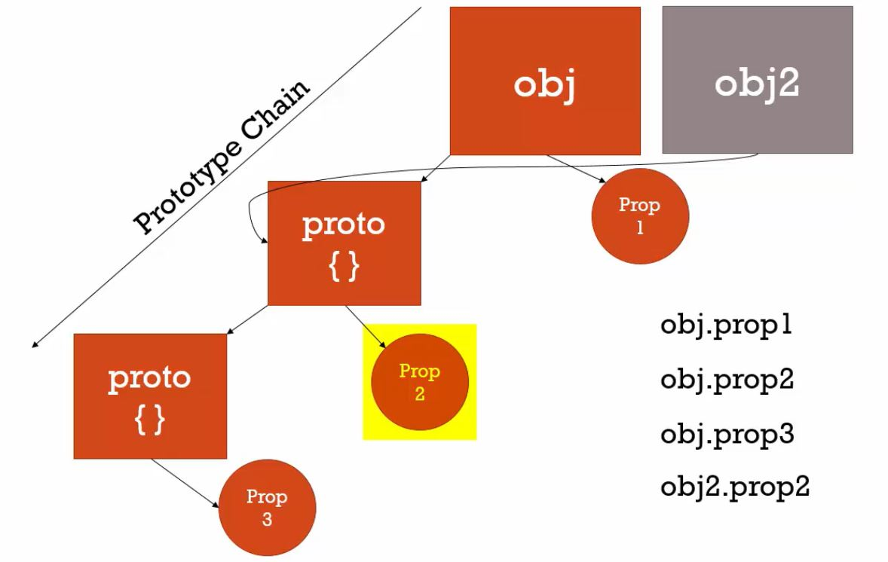

來瞭解原型吧！　　

<!-- more -->

上篇我們說過 JavaScript 採用**原型繼承**的方式，將所有物件連結起來。所以，什麼是**原型（Prototype）**？

### 原型（Prototype）

在 JavaScript 中，所有物件，包括函式、陣列，都具有**原型屬性 `__proto__`**，原型屬性會參考到另外一個物件，就是所謂的**原型物件**。

同樣的，原型物件本身也擁有原型屬性，會參考到另外一個物件，即該原型物件的原型物件。

依此類推，每個物件都具備原型物件，我們能藉由取用運算子 `.` 以及原型屬性 `__proto__` 去存取。

透過原型屬性串起來的物件，看起來就像由數個物件串起來的鍊子，我們稱之為**原型鍊（Prototype Chain）**。

下面這張圖概略解釋了原型機制：



<br>

假設有一個物件 `Obj` ，我想要存取屬性 `Prop3` ，但由於 `Obj` 本身並沒有這個屬性，所以 JS 引擎會幫我**向原型鍊尋找**，找到物件 `Obj` 原型的原型 `proto` 並取用到屬性 `Prop3` 。

JS 引擎向原型鍊尋找的過程是隱藏的，也就是說，我只要 `Obj.Prop3` ，就能取用到 `Prop3` ，而不需要特地 `Obj.__proto__.proto__.Prop3` ，

除此之外，假設有另外一個物件 `Obj2` ，它可以和物件 `Obj` **共享**同一個原型物件，並取用原型物件具備的屬性或方法，如下圖 `Prop2`。  



<br>

先前，我們也提過**範圍鍊（Scope Chain）**，指的是**函式執行**過程中，當執行環境沒有可用的變數，JS 引擎向外部詞彙環境尋找可取用的變數的過程。

這裡提到的**原型鍊（Prototype Chain）**，指的是**物件取用**過程中，物件本身沒有可用的屬性或方法，JS 引擎向原型物件尋找可用的屬性或方法的過程。

接著，我們來透過一些程式範例理解原型：

```javascript
var person = {
  firstname: 'Default',
  lastname: 'Default',
  getFullName: function(){
    return this.firstname + ' ' + this.lastname ;
  }
}

var Hai = {
  firstname: 'Hai',
  lastname: 'An',
}

// Don't do this EVER !! 
// 為了展示方便，我們得透過 __proto__ 設定 Hai 的原型，但實務上我們不會這樣做！
Hai.__proto__ = person ;

console.log(Hai.getFullName());
console.log(Hai.firstname);
```

需要特別注意的是，物件 `Hai` 呼叫方法 `getFullName` 後，JS 引擎會創造其函式執行環境，其中的變數 `this` 會代指呼叫 `getFullName` 的物件，即 `Hai` ，而非 `person` 。

同樣的程式碼，我們加上物件 `Jane` ：

```javascript
var person = {
  firstname: 'Default',
  lastname: 'Default',
  getFullName: function(){
    return this.firstname + ' ' + this.lastname ;
  }
}

var Hai = {
  firstname: 'Hai',
  lastname: 'An',
}

var Jane = {
  firstname: 'Jane',
}

// Don't do this EVER !! 
// 為了展示方便，我們得透過 __proto__ 設定 Hai 的原型，但實務上我們不會這樣做！
Hai.__proto__ = person ;
Jane.__proto__ = person ;

console.log(Jane.getFullName());
console.log(Hai.lastname);
console.log(Jane.lastname);
```

比較 `console.log(Hai.lastname);` 與 `console.log(Jane.lastname);` 的差異，可知，如果物件本身已有可用的屬性或方法，JS 就不會向原型鍊尋找。當 JS 引擎在原型鍊中找到可用的屬性或方法，便立即停止搜尋，並回傳該值。

<hr>

### 結論
* 在 JavaScript 中，所有物件，包括函式、陣列，都具有原型屬性 `__proto__`，原型屬性會參考到另外一個物件。
* 透過原型屬性串起來的物件，我們稱之為原型鍊（Prototype Chain）。
* 原型鍊指的是物件取用過程中，物件本身沒有可用的屬性或方法，因此 JS 引擎向原型物件尋找可用的屬性或方法的過程。

### 參考資料
1. JavaScript 全攻略：克服 JS 奇怪的部分 5-54
