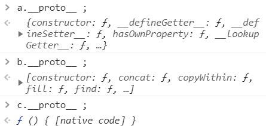
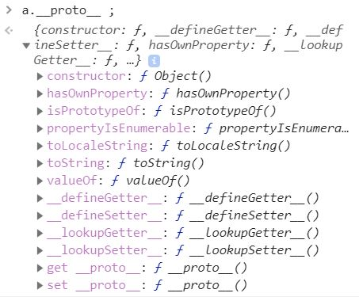
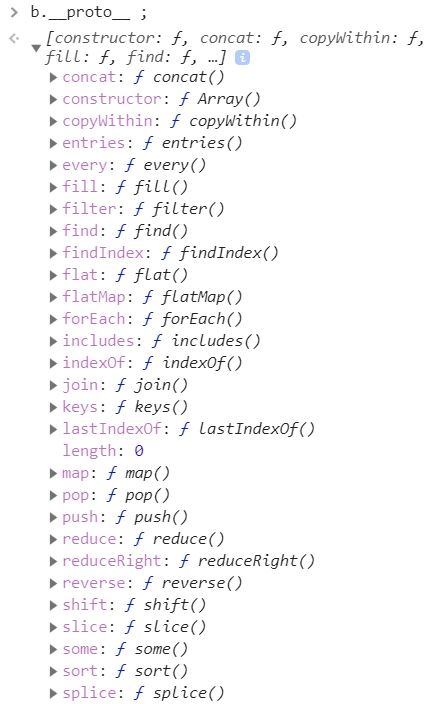
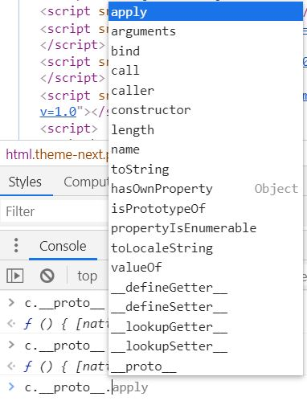
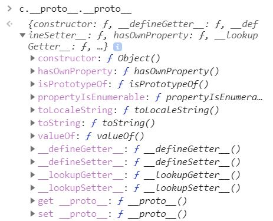
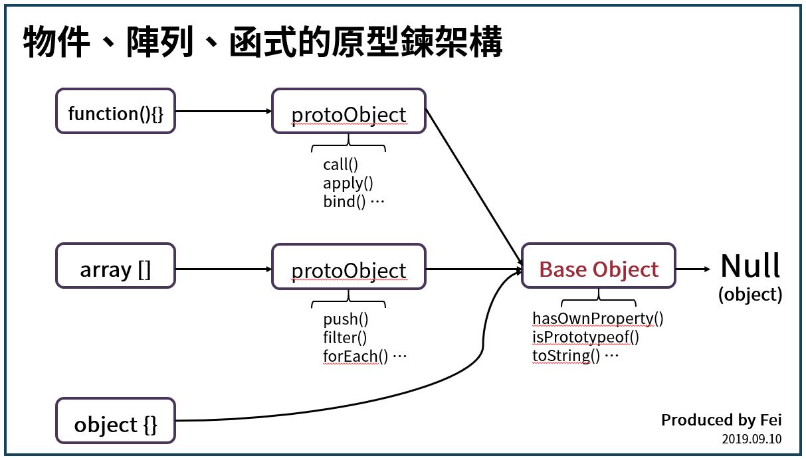

欸！ JavaScript 裡面的所有東西都是物件！

<!-- more -->

## 物件、陣列與函式的原型
---

上篇我們談到，所有物件，包括物件、陣列以及函式，都具有原型。

我們可以用這段程式碼來驗證：

```javascript
var a = {} ;
var b = [] ;
var c = function(){} ;

console.log(a.__proto__) ; 
console.log(b.__proto__) ; 
console.log(c.__proto__) ; 
```

執行上面這段程式碼，得到結果如下圖：



我們分別來看一下物件 `a` 、陣列 `b` 以及函式 `c` 的原型。

### 物件的原型


物件 `a` 的原型是一個**物件**，該物件包含一些我們平常在物件中可以取用的方法，如下圖：



以 `hasOwnProperty()` 為例：

```javascript
var a = {
  firstname: 'Hai',
  lastname: 'An'
}

a.hasOwnProperty('firstname') ; // true 
```

在任何一個物件中，我們可以取用 `hasOwnProperty()` 來檢測該**物件本身**是否有某一個屬性，因為所有物件的原型都包含了 `hasOwnProperty()` 這個方法。

也就是說，所有物件都有原型，指向一個**擁有 JS 處理物件方法的物件**。

我們可以發現，物件 `a` 的原型裡面並沒有 `__proto__` 這個屬性，表示該原型已經是原型鍊的最底層，即**基本物件（Base Object）**。

### 陣列物件的原型

我們說過，陣列也屬於物件的一種，可稱之為陣列物件。

陣列 `b` 的原型是一種**陣列物件**，該物件也包含一些我們平常在陣列中可以取用的方法，如 `push()` 、 `filter()` 、 `forEach()` 等等：



簡單來說，所有陣列都有原型，指向一個**擁有 JS 處理陣列方法的物件**。

值得注意的是，陣列 `b` 的原型 `b.__proto__` 還有 `__proto__` 這個屬性，表示 `b.__proto__` 還能向上找到它自己的原型 `b.__proto__.__proto__` ，該原型是一個基本物件，即原型鍊最底層的物件。

### 函式物件的原型

根據一級函式的特性，函式也屬於物件的一種，我們稱為函式物件。

函式 `c` 的原型是**函式物件**，該物件同樣包含一些我們平常在函式中可以取用的方法，如 `call()` 、 `apply()` 、 `bind()` 等等：



簡單來說，所有函式都有原型，指向一個**擁有 JS 處理函式方法的物件**。

與陣列物件相仿，函式 `c` 的原型 `c.__proto__` 仍有 `__proto__` 這個屬性，表示 `c.__proto__` 還能向上找到它自己的原型 `c.__proto__.__proto__` ，該原型是一個**基本物件**，即原型鍊最底層的物件。


## 結論
---

下面這張圖檢驗了 `c.__proto__.__proto__` ，結果與 `a.__proto__` 和 `b.__proto__.__proto__` 相同 ：



我們用邏輯判斷來檢驗這三者是否相同：

```javascript
var a = {} ;
var b = [] ;
var c = function(){} ;

console.log(a.__proto__ === b.__proto__.__proto__) ; // true
console.log(a.__proto__ === c.__proto__.__proto__) ; // true
console.log(b.__proto__.__proto__ === c.__proto__.__proto__) ; // true  
```

我們發現，物件、陣列與函式的原型鍊最終會指向同一個**基本物件！**

總而言之，**除了刻意設定原型，如 `setPrototypeOf` 、 `Object.create()` 、 `new` 等情況以外**，JS 引擎會自動幫我們設定物件、陣列與函式的原型，該**原型包含一些 JS 內建處理資料的方法**。

而無論是哪一種資料型別，資料的**原型鍊終點都會指向基本物件**！

咦？你問基本物件的原型是什麼？
```javascript
var a = {} ;
console.log(a.__proto__.__proto__) ; // null
```
沒錯，就是 `null` ！

那你知道 `null` 屬於什麼資料型態嗎？
```javascript
typeof null ; // object 
```
欸！就說了， **JavaScript 裡面的所有東西都是物件！**

<!-- 最後，我們可以畫出這張物件、陣列與函式的原型鍊結構： -->

<!--  -->


## 參考資料
---
1. JavaScript 全攻略：克服 JS 奇怪的部分 5-54


